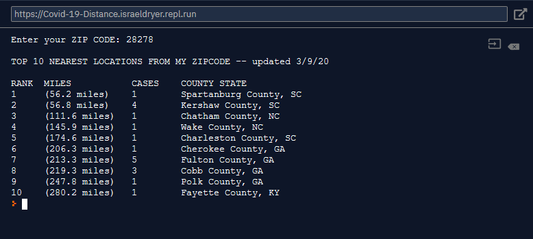

# Covid-19
A simple script that shows how close you are to confirmed COVID-19 cases. Uses data from [HERE](https://raw.githubusercontent.com/CSSEGISandData/COVID-19/master/csse_covid_19_data/csse_covid_19_time_series/time_series_19-covid-Confirmed.csv)

Run the program on repl.it: [https://Covid-19-Distance.israeldryer.repl.run](https://Covid-19-Distance.israeldryer.repl.run)
  

